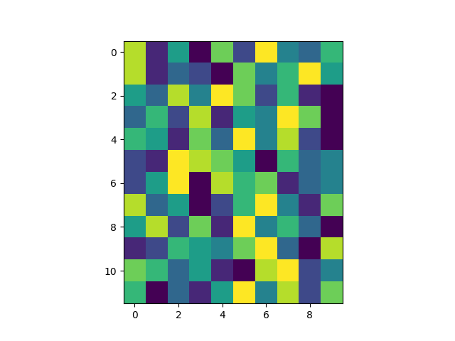
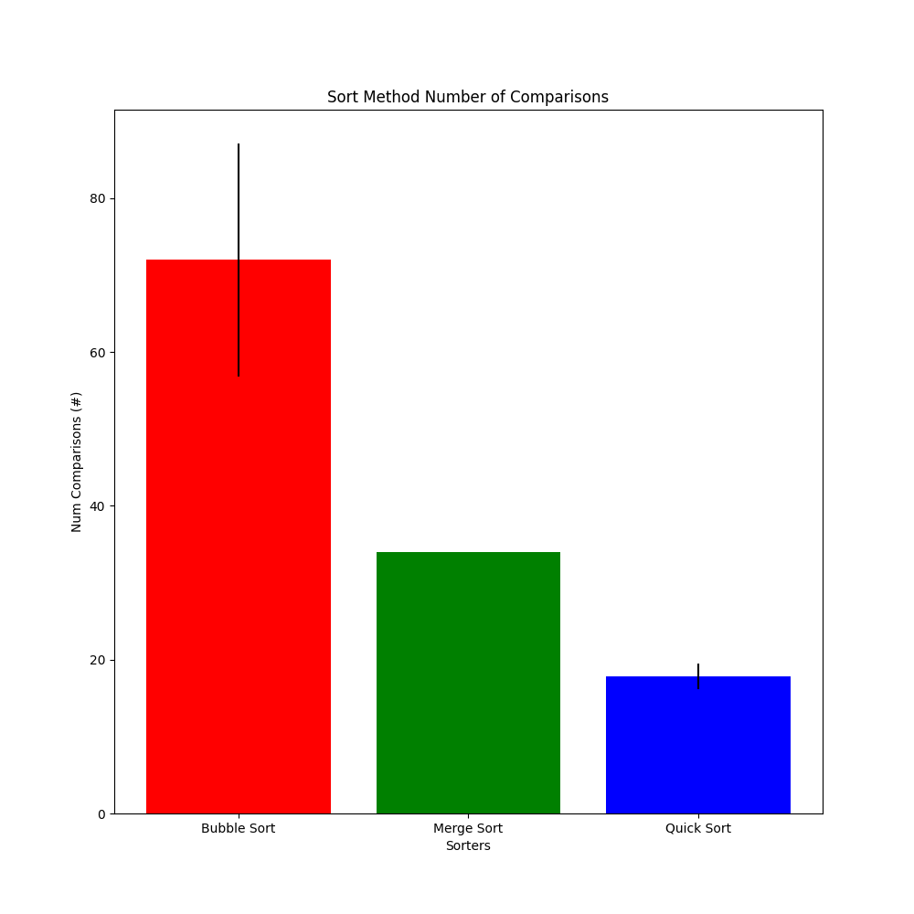

# SortViz


A Python package for visualizing various sorting methods.


# Sorters

## Bubble Sort
  

## Merge Sort
  

## QuickSort
  

## Sort Algorithm Comparison
  

# Installation

1. Git clone the repository
    ```bash
    git clone git@github.com:GeoffBarrett/SortViz.git
    ```
1. Install Poetry
    ```bash
    pip install poetry==1.3.2
    ```
1. Install Package
    ```bash
    poetry install
    ```


# Run Tests

```bash
poetry run ./test.sh
```
